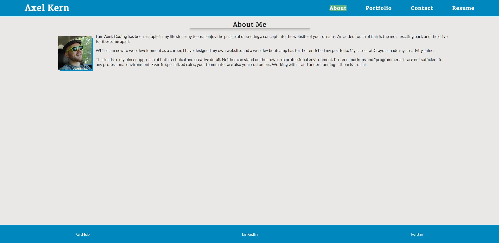

# Sleek Portfolio using React

[](https://www.github.com/Axeljk/uw_m20_react_portfolio/blob/main/license)

## Description
After three months in a full-stack bootcamp I've learned a lot. Putting some of that to good use by re-making a portfolio, this time using modern tools like React.

<details>
<summary>Click to view table of contents</summary>

## Table of Contents
* [Installation](#installation)
* [Usage](#usage)
* [Contributors](#contributors)
* [License](#license)
* [Questions](#questions)
</details>

## Installation
Download or clone GitHub repo. Navigate to the unzipped folder and install dependencies with the following:

 ```bash
npm i
```

You may also need to run create-react-app. Then you can start the server with the following:

```bash
npm start
```

## Usage
You can view the site [here](https://axeljk.github.io/uw_m20_react_portfolio).



## Contributors
- Axel Kern, main author
- Abbey Free, supporting me in all things

## License
Licensed under the [MIT](https://www.github.com/Axeljk/uw_m20_react_portfolio/blob/main/license) license.

## Questions
If you have any questions, open an issue or contact directly at [axeljkern@yahoo.com](mailto:axeljkern@yahoo.com). You can find more of my work on [GitHub](https://www.github.com/Axeljk).